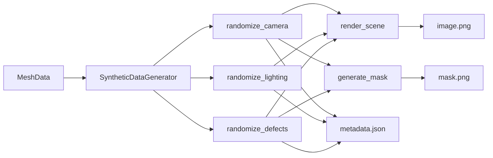

# Synthetic Data Generation Pipeline

> **Goal**: Solve the "Data Scarcity" problem in AI by using simulation to generate unlimited training data.

## Overview

The synthetic data pipeline generates training datasets for defect detection ML models by procedurally creating diverse images with ground truth masks.

### What It Generates

For each sample:
| File | Description |
|------|-------------|
| `image_{i}.png` | RGB render with randomized camera/lighting |
| `mask_{i}.png` | Binary mask (white=defect, black=background) |
| `metadata_{i}.json` | Camera pose, lighting params, defect locations |

---

## Quick Start

### In the Streamlit UI

1. Load a mesh (STL/OBJ upload or sample part)
2. In the sidebar, find **🧪 Synthetic Data Pipeline**
3. Adjust the number of samples (5-100)
4. Click **🏭 Generate Training Data**
5. Watch the progress bar as scenes are rendered

Output: `synthetic_data/` folder with all files.

### Programmatic Usage

```python
from src.simulation.synthetic_data_gen import generate_dataset, SyntheticDataGenerator
from src.visualization.mesh_loader import load_mesh

# Load mesh
mesh_data = load_mesh("path/to/mesh.stl")

# Generate 50 samples
results = generate_dataset(
    mesh_data=mesh_data,
    num_samples=50,
    output_dir="synthetic_data",
    seed=42,
    num_defects_per_sample=3
)
```

---

## Randomization

### Camera
| Parameter | Range | Description |
|-----------|-------|-------------|
| Azimuth | 0-360° | Horizontal rotation around mesh |
| Elevation | 15-60° | Vertical angle (avoids top-down/bottom-up) |
| Distance | 0.8x-1.2x mesh scale | Zoom variation |

### Lighting
| Parameter | Range | Description |
|-----------|-------|-------------|
| Azimuth | 0-360° | Light source horizontal position |
| Elevation | 10-80° | Light source height |
| Intensity | 0.7-1.3 | Brightness multiplier |
| Ambient | 0.2-0.5 | Fill light level |

### Defects
| Parameter | Range | Description |
|-----------|-------|-------------|
| Position | On mesh surface | Sampled using `sample_surface_points()` |
| Size | 2-8% of mesh scale | Defect radius |
| Type | rust, crack, dent | Random selection |

---

## Output Format

### Metadata JSON Structure

```json
{
  "sample_id": 0,
  "camera": {
    "azimuth": 45.3,
    "elevation": 30.2,
    "distance": 0.85
  },
  "lighting": {
    "azimuth": 120.5,
    "elevation": 45.0,
    "intensity": 1.1,
    "ambient": 0.35
  },
  "defects": [
    {
      "position": [0.1, -0.05, 0.2],
      "normal": [0.0, 0.0, 1.0],
      "size": 0.03,
      "defect_type": "rust"
    }
  ],
  "mesh_name": "turbine_blade",
  "image_size": [800, 600]
}
```

### Dataset Summary

After generation, `dataset_summary.json` contains:
- Total samples generated
- Mesh name and settings
- List of all file paths

---

## Architecture



---

## Use Case: Training Defect Detection Models

```python
import torch
from torch.utils.data import Dataset
from PIL import Image
import json

class SyntheticDefectDataset(Dataset):
    def __init__(self, data_dir, transform=None):
        self.data_dir = Path(data_dir)
        with open(self.data_dir / "dataset_summary.json") as f:
            self.summary = json.load(f)
        self.transform = transform
    
    def __len__(self):
        return self.summary["num_samples"]
    
    def __getitem__(self, idx):
        image = Image.open(self.data_dir / f"image_{idx:04d}.png")
        mask = Image.open(self.data_dir / f"mask_{idx:04d}.png")
        
        if self.transform:
            image = self.transform(image)
            mask = self.transform(mask)
        
        return image, mask
```

---

## Module Reference

### `generate_dataset()`

Main entry point for batch generation.

**Parameters:**
- `mesh_data` (MeshData): Mesh to render
- `num_samples` (int): Number of samples to generate (default: 50)
- `output_dir` (str): Output directory path (default: "synthetic_data")
- `seed` (int): Random seed for reproducibility (default: 42)
- `num_defects_per_sample` (int): Defects per sample (default: 3)
- `progress_callback` (callable): Optional `callback(current, total)` for progress

**Returns:** List of dicts with file paths

### `SyntheticDataGenerator`

Low-level class for custom generation workflows.

**Methods:**
- `randomize_lighting()` → LightingParams
- `randomize_camera()` → CameraParams
- `randomize_defects(num)` → List[SyntheticDefect]
- `render_scene(defects, camera, lighting)` → bytes (PNG)
- `generate_mask(defects, camera)` → bytes (PNG)
- `generate_sample(sample_id)` → (image, mask, metadata)
